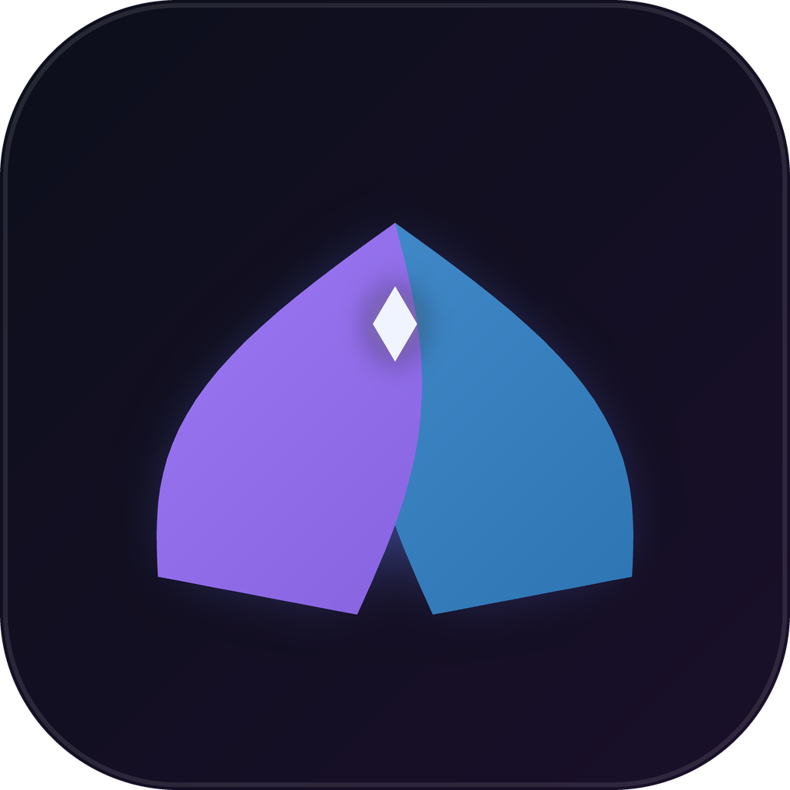
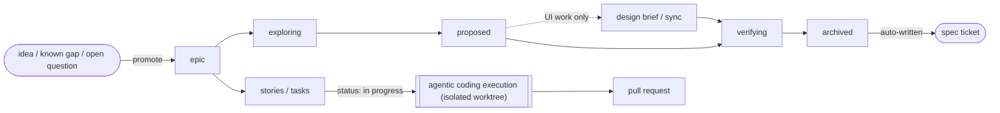

<div align="center">
  

  # Aion

  **A spec-based AI agentic code assistant with a Jira-like project
  management structure — planning, tracking, and coding in one app.**

  [](LICENSE)
  [](https://flutter.dev)
  [](#stack)
  [](CHANGELOG.md)
</div>

---

## What is Aion?

Most solo/small-team dev work is split across three disconnected tools: a
project tracker for *what* to build, a chat window for *talking through* how
to build it, and an editor (plus an AI coding assistant) for *actually*
building it. Context gets lost at every handoff — the ticket doesn't know
what the chat decided, the chat doesn't know what the code actually does.

Aion collapses all three into one Flutter app, built around a single idea:
**everything is a ticket**, and every ticket can think. An epic, a task, a
piece of documentation, and an AI conversation are all the same underlying
entity — they link freely, and a ticket's own chat can read and act on
everything else Aion knows about your project.

Concretely, that gets you:

- A **project tracker** (epics/stories/tasks/bugs, Kanban board, search,
  trash) that any Jira/Linear user would recognize.
- A **spec-driven AI workflow** (explore → propose → apply → verify →
  archive) running natively inside that same tracker — no separate planning
  tool, no context copy-pasted between apps.
- **Real agentic coding execution** — an AI agent with file/git access
  that implements a ticket, verifies its own work, and opens a pull request,
  isolated in its own git worktree so it can never touch your uncommitted
  work.
- **Model-agnostic routing** — swap or mix AI providers per phase of work
  (a cheap model for bookkeeping, a stronger one for architecture calls),
  instead of being locked to one vendor.

Aion is also self-hosted in the most literal sense: **this repository's own
development runs through Aion's own ticket-native workflow.** It plans,
executes, and reviews its own features the same way it would for any
project you point it at.

## Key features

<table>
<tr>
<td width="50%" valign="top">

**Project management**
- Epic → Story → Task/Bug hierarchy with a strict, enforced
  type-compatibility model
- Kanban board and list views, drag-and-drop, saved filters, full-text
  search with pagination
- Bulk edit and soft-delete (Trash) with cascade, age tracking, and manual
  or automatic purge
- `blocks`/`blockedBy` dependency tracking with a hard gate on starting
  blocked work
- Estimate/time-spent rollups up the hierarchy, live token-cost prediction
  before and during a run

</td>
<td width="50%" valign="top">

**Documentation & knowledge**
- Notion-style nested pages with a full Markdown editor
- Inline `[[wikilink]]` backlinks between docs
- Idea/Known Gap/Open Question tickets that link straight to the
  documentation they concern
- A Spec ticket type, auto-written from an epic's outcome the moment it
  archives — Aion's own living record of what it built and why

</td>
</tr>
<tr>
<td width="50%" valign="top">

**Agentic execution**
- Ticket-native SDD lifecycle: explore → propose → apply → verify →
  archive, each stage a real, watchable AI chat
- Coding execution in an isolated git worktree, with a pre-PR verify gate
  and automatic PR metadata parsing
- Concurrent, cancellable, restart-safe runs (Strict FIFO / Parallel /
  Hybrid scheduling)
- Project-editable decision graphs and confidence levels
  (auto/gated/manual) controlling exactly how much Aion does unattended

</td>
<td width="50%" valign="top">

**Platform**
- Pluggable model-provider abstraction — Claude Agent SDK today, a second
  Anthropic-Messages-API provider already proven against it
- Per-phase model routing (cheap model for bookkeeping, capable model for
  judgment calls, execution-tier model for coding)
- Local-first: SQLite (drift) persistence, ticket data git-projected to
  plain Markdown, on-device embeddings — no backend, no required account
- Multi-project Hub: manage more than one codebase, each with its own
  database, git repo, and configurable baseline

</td>
</tr>
</table>

## How it works

Every entity in Aion — an epic, a story, a task, a bug, a documentation
page, an AI conversation — is a row in the same `tickets` table, related to
each other by structural parent/child links or freeform cross-links
(`blocks`, `relatesTo`, `duplicates`, ...). A ticket's own comment thread
*is* its chat transcript, so "ask the AI about this ticket" and "read this
ticket's history" are the same screen.

Turning a raw idea into shipped code follows one lifecycle, driven entirely
through the ticket UI:



Each arrow is a real, configurable gate — how much of it runs unattended
versus waits for you is controlled per-project by `AutomationConfidence`
(`auto` / `gated` / `manual`), not hardcoded.

## Status

**v0.1.0 — first release.** See [`CHANGELOG.md`](CHANGELOG.md) for the full
list of what shipped. In short: the complete ticket/board/documentation
experience, a working agentic coding-execution pipeline, the pluggable
provider layer, and the ticket-native spec-driven workflow described above
are all real and in daily use — Aion is actively building itself with them.
This is a solo project, still early, with rough edges expected.

## Getting started

Aion is a standard Flutter app — no backend, no account, no API keys
required to explore the UI (a configured model provider is only needed to
use the AI features).

```bash
git clone https://github.com/ruansilvx/aion.git
cd aion
flutter pub get
flutter run -d windows   # or macos / linux / chrome / an attached device
```

Requires the [Flutter SDK](https://docs.flutter.dev/get-started/install)
(`^3.12.2`, per `pubspec.yaml`). Prebuilt Windows/Linux installers will
appear under [Releases](../../releases) once a version tag is pushed.

To enable the AI features, open **Settings → Providers** inside the app
and connect a supported model provider.

## Stack

- **Flutter** — single codebase targeting iOS, Android, web, macOS,
  Windows, Linux
- **flutter_bloc** (Cubit) for state management
- **drift** (SQLite) for local persistence — local-first, no backend
- **go_router** for navigation
- Custom non-Material design system (two themes, Arctic/Obsidian) — no
  `ThemeData`/`MaterialApp`/`Scaffold` anywhere in the app

## License

MIT — see [LICENSE](LICENSE).
